Manual
######

Descargar
*********

-Primero de todo tenemos que entrar en la pagina web https://www.jetbrains.com/phpstorm/ y descargar donde dice download

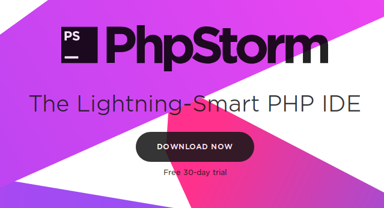

Instalacion
***********

- Una vez descargado tenenos que abrir el instalador con doble click o boton derecho y abrir 
- Presionamos en NEXT

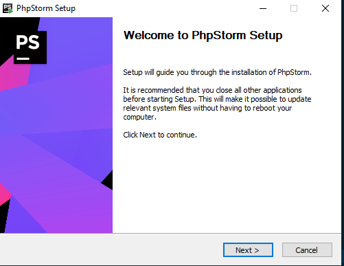

- Selecionamos el destino de la instalacion y NEXT

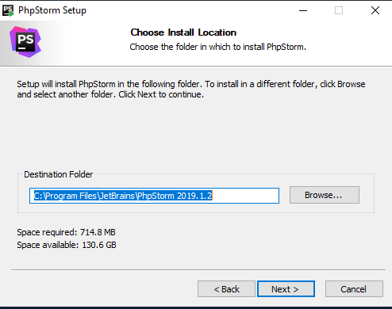

- Dejaremos tal cual el nombre y NEXT

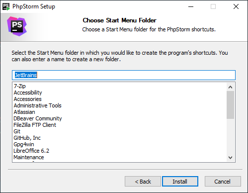

- Esperamos a que se finalize la instalacion..

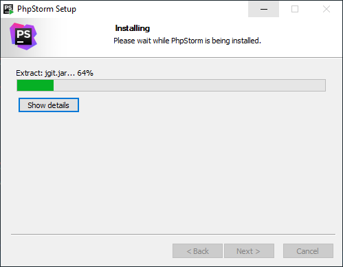
   
- Hacemos click en FINISH

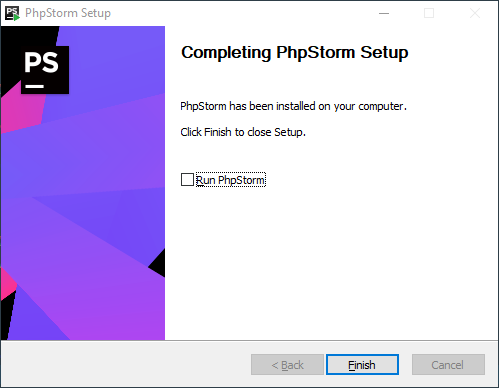

- y listo ya lo tendremo instalado el Phpstorm

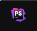

Ejecucion
*********

- Al ejecutar nos pedira para importar la configuracion para el phpstorm selecionamos DO NOT IMPORT SETTINGS y OK

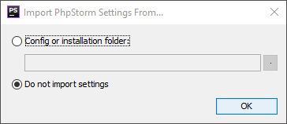

- Nos pedira para poder selecionar el tema para nuestro phpstorm selecionamos el que mas nos guste y hacemos click en NEXT

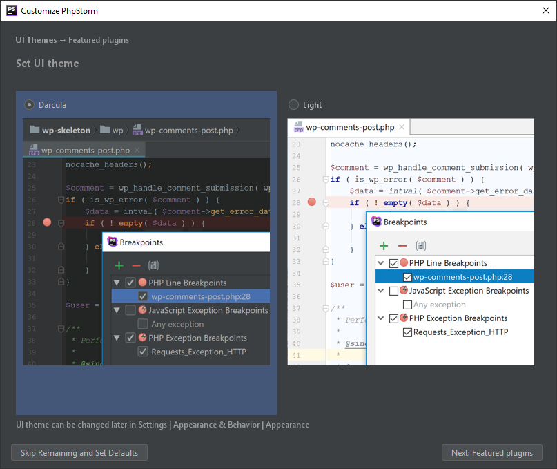

- Tambien nos pedira para poder instalar plugins (Extenciones) para nuestro phpstorm y hacemos click en NEXT

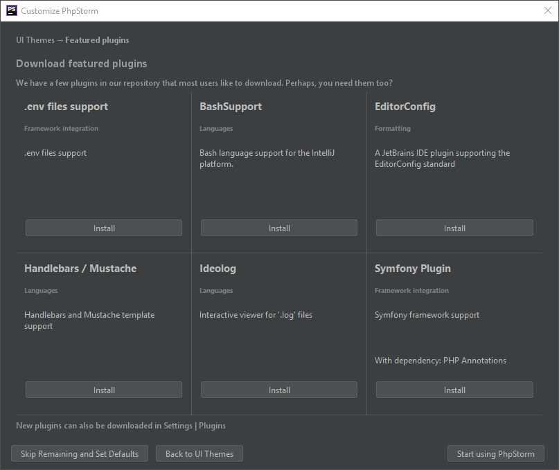

- Como ya sabemos que phpstorm es de licencia pero nos da la opion de prueba gratiuita de 30 Dias selecionamos Evaluate for free y hacemos click en ACTIVATE

.. image:: 10.PNG
   :width: 1000 px
.. image:: sel.png
   :width: 1000 px

Hola mundo
**********

- Hacemos click en Create New Project

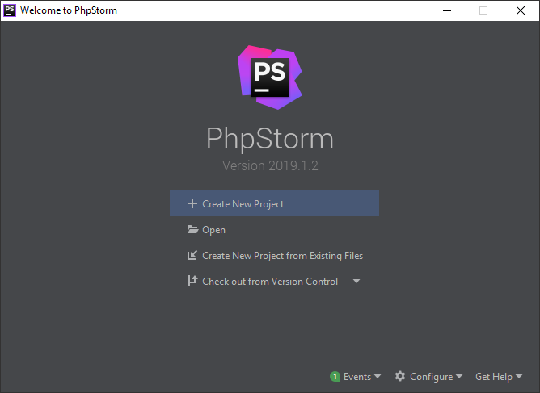

- Selecionamos Php Empty project y CREATE 

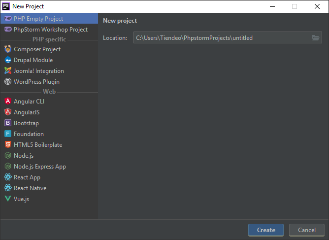

- Y listo Ya tenemos nuestro projecto creado 

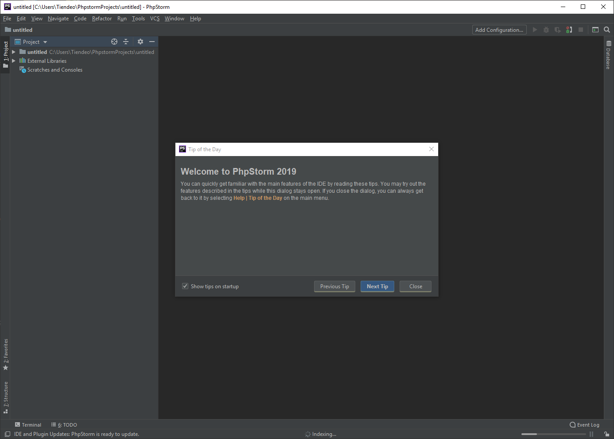

- Para poder hacer un hola mundo tenemos que poner 

<?php

echo 'hola mundo'; 

?>

- y guardar el archivo ctrl + s 

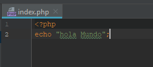

- Abrimos la el terminal con alt + f12 y escribimos php (nombre del archivo)
- Y nos aparecera el Hola mundo 

.. image:: 15.PNG
   :width: 1000 px

- Si tenemos algun error en el fichero nos va a avisar de la siguiente manera

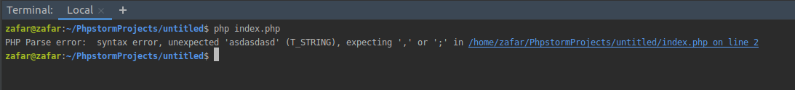

Ampliacion
**********

- Para poder trabajar con otros lenguajes tendremos que crear un nuevo projecto por ello vamos a FILE > CREATE NEW PROJECT 

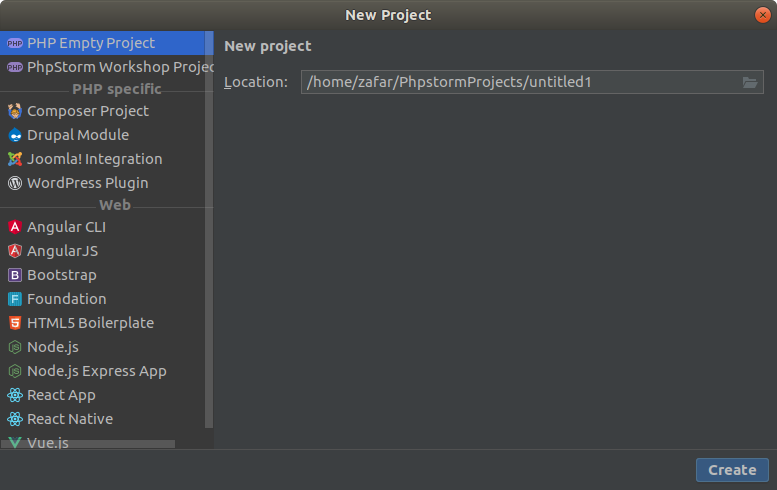

- Selecionamos el projecto que queramos en este caso selecionare REACT APP y CREATE

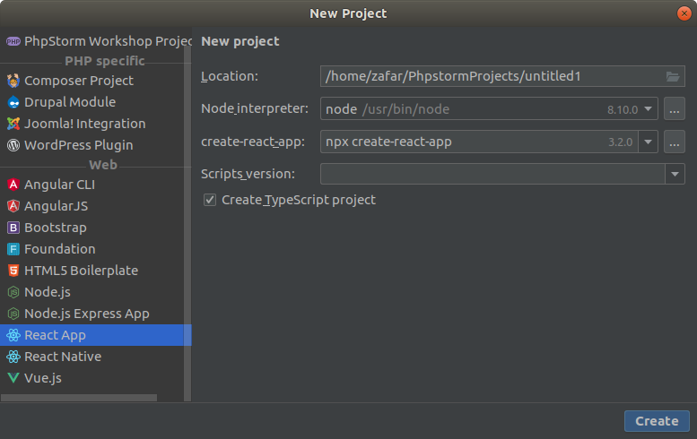

- Se nos empezara a descargar el projecto de REACT

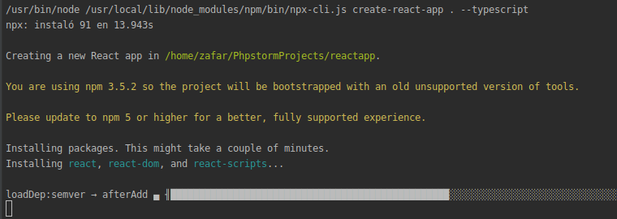

- Done

.. image:: 23.png
   :width: 1000 px
   
- Para inciar la aplicaion REACT abrimos el terminal alt + f12 y escribimos 

npm start 

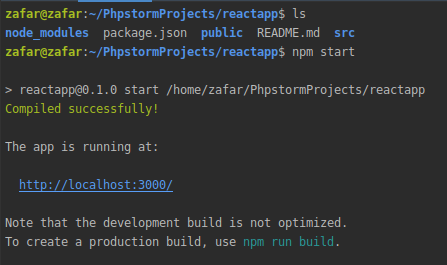

- Abrimos un navegador y escribimos http://localhost:3000/

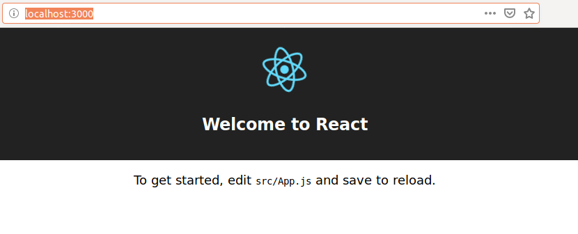

- Listo!!!!!!!! A Programar!!!!

Interfaz Grafica
****************

-No tiene Interfaz Grafica

