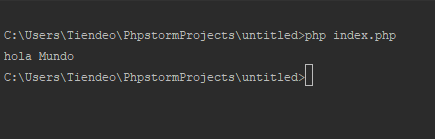
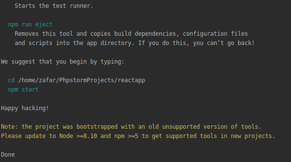

Manual
######

Descargar
*********

-Primero de todo tenemos que entrar en la pagina web https://www.jetbrains.com/phpstorm/ y descargar donde dice download

Instalacion
***********

- Una vez descargado tenenos que abrir el instalador con doble click o boton derecho y abrir 
- Presionamos en NEXT

.. image:: 1.PNG
   :width: 1000 px

- Selecionamos el destino de la instalacion y NEXT

.. image:: 2.PNG
   :width: 1000 px

- Dejaremos tal cual el nombre y NEXT

.. image:: 3.PNG
   :width: 1000 px

- Esperamos a que se finalize la instalacion..

.. image:: 4.PNG
   :width: 1000 px
   
- Hacemos click en FINISH

- y listo ya lo tendremo instalado el Phpstorm

.. image:: 6.PNG
   :width: 200 px

Ejecucion
*********

- Al ejecutar nos pedira para importar la configuracion para el phpstorm selecionamos DO NOT IMPORT SETTINGS y OK

.. image:: 7.PNG
   :width: 1000 px

- Nos pedira para poder selecionar el tema para nuestro phpstorm selecionamos el que mas nos guste y hacemos click en NEXT

.. image:: 8.PNG
   :width: 1000 px

- Tambien nos pedira para poder instalar plugins (Extenciones) para nuestro phpstorm y hacemos click en NEXT

.. image:: 9.PNG
   :width: 1000 px

- Como ya sabemos que phpstorm es de licencia pero nos da la opion de prueba gratiuita de 30 Dias selecionamos Evaluate for free y hacemos click en ACTIVATE

.. image:: 10.PNG
   :width: 1000 px
.. image:: sel.png
   :width: 1000 px

Hola mundo
**********

- Hacemos click en Create New Project

.. image:: 11.PNG
   :width: 1000 px

- Selecionamos Php Empty project y CREATE 

.. image:: 12.PNG
   :width: 1000 px

- Y listo Ya tenemos nuestro projecto creado 

.. image:: 13.PNG
   :width: 1000 px

- Para poder hacer un hola mundo tenemos que poner 

<?php

echo 'hola mundo'; 

?>

- y guardar el archivo ctrl + s 

- Abrimos la el terminal con alt + f12 y escribimos php (nombre del archivo)
- Y nos aparecera el Hola mundo 

- Si tenemos algun error en el fichero nos va a avisar de la siguiente manera

.. image:: error.png
   :width: 1000 px

Ampliacion
**********

- Para poder trabajar con otros lenguajes tendremos que crear un nuevo projecto por ello vamos a FILE > CREATE NEW PROJECT 

.. image:: 20.png
   :width: 1000 px

- Selecionamos el projecto que queramos en este caso selecionare REACT APP y CREATE

.. image:: 21.png
   :width: 1000 px

- Se nos empezara a descargar el projecto de REACT

.. image:: 22.png
   :width: 1000 px

- Done

   
- Para inciar la aplicaion REACT abrimos el terminal alt + f12 y escribimos 

npm start 

.. image:: 24.png
   :width: 1000 px

- Abrimos un navegador y escribimos http://localhost:3000/

.. image:: 25.png
   :width: 1000 px

- Listo!!!!!!!! A Programar!!!!

Interfaz Grafica
****************

-No tiene Interfaz Grafica

